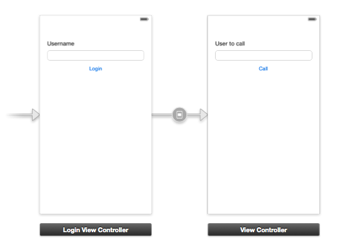

#Building a Simple iOS VoIP App

In this tutorial, you will learn how to use the Sinch SDK to make an iOS VoIP call and build a basic calling app.

##Start

If you don't have an account with Sinch, sign up for one at [www.sinch.com/signup](http://www.sinch.com/signup). Set up a new application using the [Dashboard](http://www.sinch.com/dashboard/#/apps "Sinch Dashboard") and take note of your application key and secret. 

Next:

*   Launch Xcode and create a new project (File&gt;New&gt;Project)
*   Select 'Single View Application' and click Next
*   Name the project 'CallingApp' and save it

The easiest way to add the Sinch SDK is to use CocoaPods. In your Xcode project directory, create a _Podfile_ with the content below.

````objective-c
platform :ios, '7.0'
pod 'SinchRTC'
````

Now, open a terminal window in your Xcode project directory and type `pod install`. Remember to open the workspace in Xcode when using CocoaPods.

_Note: If you are new to CocoaPods, go to [cocoapods.org](http://cocoapods.org/) to learn how to install it._

##Login

To enable app-to-app calling, you must start the _SINClient_ with a username. In this example, you will let the user type in any username he or she wants with no password.

First, create a new ViewController (File&gt;New&gt;File)

*   Select objective-c class and click Next
*   Name the file _LoginViewController_
    Make sure UIViewController is the subclass

Now, open **Main.Storyboard** and add 

*   A label with Username
*   Empty textbox
*   Button with the label Login


Set the custom class of the view to **LoginViewController**. 

Next, open the Assistant Editor (View&gt;Assitant Editor&gt;Show Assistant Editor). Create an outlet for the textfield by pressing Control and dragging into **LoginViewController.h** in the Assistant Editor. Name the outlet username.

Create an action from the button by repeating the step from above, but choose action as connection. Name the method login.

_Note: Sometimes the assistant chooses **.m** files instead of **.h**. Make sure you are in the right one._

Open **LoginViewController.m** add `@synthesize userName;` below the [@implementation](https://github.com/implementation) line.

## Login action

When the user clicks on the login button, you want to present the CallScreenView. Add a new view to your storyboard with the following:

*   A label with User to call
*   Empty textbox
*   Button with the label Call

Add a modal segue from the files owner of LoginViewController to the above CallscreenView and name it showCallScreen. The storyboard should now look like this:



Open **LoginViewController.m** and add the login method for the button.

	-(IBAction)login:(id)sender {
	    if (username.text != nil ) {
	    [self performSegueWithIdentifier:@"showCallScreen" sender:username.text];
	    }
	}

The above code will perform the Segue if the username is not empty. To pass the username to the call screen, you need to implement prepareForSegue. Add the following code to **LoginViewController.m**:

	-(void)prepareForSegue:(UIStoryboardSegue*)segue sender:(id)sender
	{
	    // check that its the right segue
	    if ([segue.identifier isEqualToString:@"showCallScreen"])     {
	    // TODO, get the view controller for call screen
	    }
	}

Now compile and run the app. You should see the callscreen after pressing login.

##Adding a CallScreenViewController

Create a new ViewController and call it **CallScreenViewController**. This controller will handle all call activity in the app. Set the custom class of the view Callscreen to **CallScreenViewController** in interfacebuilder. Then, open the **CallScreenViewController.h** and add the following property:

	#import <UIKit/UIKit.h>
	@interface CallScreenViewController : UIViewController
	@property NSString* username;
	@end

Also add `@synthesize username` to the **CallScreenViewController.m** file. Go back to **LoginViewController.m** and add `#import "CallScreenViewController.h"` to your imports. Change `-(void)prepareForSegue:(UIStoryboardSegue*)segue sender:(id)sender` to:

	-(void)prepareForSegue:(UIStoryboardSegue*)segue sender:(id)sender {
	    // Check that it's the right segue
	    if ([segue.identifier isEqualToString:@"showCallScreen"]) 
	    {
	    // Get destination viewController
	    CallScreenViewController *vc = [segue destinationViewController];
	    // Set the username property of CallScreenViewController
	    vc.username = sender;
	    }
	}
	@end

##Call screen implementation

The CallScreenViewController will be responsible for handling all events from the SinchClient. To enable this, open **CallScreenViewController.h** and add the following import:

	#import <Sinch/Sinch.h>

The CallScreenViewController must implement the SINCallClientDelegate and SINCallDelegate protocol. SINCallClientDelegate protocol handles events such as incoming call notification, and the SINCallDelegate protocol handles in-call events such as when a call is connected or ended. 

	@interface CallScreenViewController : 
	UIViewController <SINCallClientDelegate, SINCallDelegate>

##Prepare to make a call

To make and receive calls, you will need an instance of the SinchClient. Open **CallScreenViewController.m** and add the following instance variable:

	@interface CallScreenViewController ()
	{
	    id<SINClient> _client;
	}
	@end

Now add a method to start the client, making sure to insert your application key and application secret here. When you are starting the client, everything necessary to handle calls is set up.  

	- (void)initSinchClient {
	    _client = [Sinch clientWithApplicationKey:@"your_key"
	    applicationSecret:@"your_secret"
	    environmentHost:@"sandbox.sinch.com"
	    userId:self.username];
	    _client.callClient.delegate = self;
	    [_client setSupportCalling:YES];
	    [_client start];
	    [_client startListeningOnActiveConnection];
	}

Replace the code in `viewDidLoad` with the following:

	- (void)viewDidLoad
	{
	    [super viewDidLoad];
	    [self initSinchClient];
	}

##Make a call

Follow these steps to connect the user interface to enable the user to call:

*   Open **Main.storyboard** and select the call screen
*   Create an outlet for the textview call it remoteUsername
*   Create an action for the button that you call `callUser:`

Don't forget to synthesize them in your **.m** file.
        Your **CallScreenViewController.h** should now look like this:
		        
		#import <UIKit/UIKit.h>
		#import <Sinch/Sinch.h>
		@interface CallScreenViewController : 
		    UIViewController <SINCallDelegate, SINCallClientDelegate>
		@property NSString* username;
		@property (strong, nonatomic) IBOutlet UITextField *remoteUsername;
		- (IBAction)callUser:(id)sender;
		@end

Open **CallScreenViewController.m** and add an instance variable for a call:

	id<SINCall> _call;

When user clicks call, set up a voice conversation in callUser:

	-(IBAction)callUser:(id)sender {
	    _call = [_client.callClient callUserWithId:self.remoteUsername.text]; // Create the call
	    _call.delegate = self; // Listen for events on self
	}

##Answering the call

To answer a call, you need to add code in didReceiveIncomingCall. In this example, you will accept all calls, but in a normal application, you would display a UI in which the user could accept or reject a call. 

	- (void)client:(id<SINCallClient>)client didReceiveIncomingCall:(id<SINCall>)call {
	    // For now we are just going to answer calls, 
	    // in a normal app you would show in incoming call screen
	    call.delegate = self;
	    _call = call;
	    [_call answer];
	}

Next, you will implement the protocol for the call delegate. The different states of a phone call are: in progress (trying to connect), established, and ending. These events are quite useful as a developer because this is where you can record start times or make changes to the UI to hang up calls, for instance.

	#pragma mark - SINCallDelegate
	- (void)callDidProgress:(id<SINCall>)call {
	    // In this method you can play ringing tone and update ui to display progress of call.
	}
	- (void)callDidEstablish:(id<SINCall>)call {
	    // Called when a call connects.
	}
	- (void)callDidEnd:(id<SINCall>)call {
	    // Called when call finnished.
	}

##Run the app

*   Compile and run on the device emulator
*   Log in as **A**
*   Compile and run on your iPhone*. Log in as **B**
*   On the iPhone, type **A** in the 'to user' box,  and press 'call'

(For testing, I usually turn on some music on the computer, step outside the room, and listen on the iPhone.)

##Hanging up the call

Of course, you’ll want a way to end the call. Open up **Main.storyboard** and create an outlet called 'callButton' from the call button.

You will want to change the text of the call button when a call changes state. Open **CallScreenViewController.m**, add callButton to your @synthezise, and change the delegate methods:

	- (void)callDidEstablish:(id<SINCall>)call {
	    // Change to hangup when the call is connected
	    [self.callButton setTitle:@"Hang up" forState:UIControlStateNormal];
	}
	-(void)callDidEnd:(id<SINCall>)call {
	    // Change to call again
	    [self.callButton setTitle:@"Call" forState:UIControlStateNormal];
	    _call = nil;
	}
	
You also need to change the callUser function to hang up a call instead of dialing if a call is in progress:

	- (IBAction)callUser:(id)sender {
	    if (_call == nil){
	        _call = [_client.callClient callUserWithId:self.remoteUserId.text];
	      _call.delegate = self;
	    }
	    else{
	      [_call hangup];
	      _call = nil;
	    }
	}

## Problems

If you are running into problems, there are a couple of easy ways to troubleshoot.

*   Make sure application key and secret are correct. Do you have a provisioning profile set?
*   If it still doesn't work, email me at [christian@sinch.com](mailto:christian@sinch.com) to ask questions.

## Add logging

To help diagnose the problem, you can add logging on the _SINClient_. In  **CallScreenViewController.h**, add the following protocol SINClientDelegate:

	@interface CallScreenViewController : UIViewController <SINClientDelegate, SINCallClientDelegate, SINCallDelegate>

Also add the following methods to **CallScreenViewController.h**:

	#pragma mark - SINClientDelegate
	- (void)clientDidStart:(id<SINClient>)client {
	    NSLog(@"Sinch client started (version: %@)", [Sinch version]);
	}
	- (void)clientDidStop:(id<SINClient>)client {
	    NSLog(@"Sinch client stopped");
	}
	- (void)clientDidFail:(id<SINClient>)client error:(NSError*)error {
	    NSLog(@"Error: %@", error.localizedDescription);
	}
	- (void)client:(id<SINClient>)client
	    logMessage:(NSString *)message
	    area:(NSString *)area
	    severity:(SINLogSeverity)severity
	    timestamp:(NSDate *)timestamp {
	    // If you want all messages remove the if statement
	    if (severity == SINLogSeverityCritical) {
	    NSLog(@"%@", message);
	    }
	}

Set the delegate of the SINClient in `-(void)initSinchClientWithUserId:` as follows:

	 - (void)initSinchClientWithUserId:(NSString*)userId {
	    _client = [Sinch clientWithApplicationKey:@"your key"
	    applicationSecret:@"your secret"
	    environmentHost:@"sandbox.sinch.com"
	    userId:self.userName];
	    // Add logging by setting delegate to self
	    _client.delegate = self;
	    [_client setSupportCalling:YES];
	    _client.callClient.delegate = self;
	    [_client start];
	    [_client startListeningOnActiveConnection];
	}
